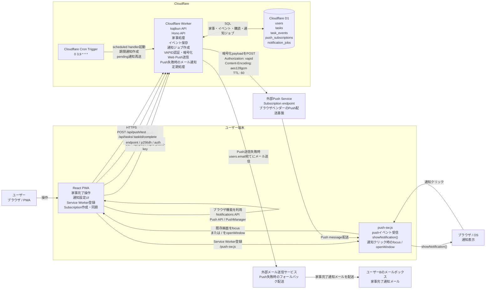

# Push通知機能 システム構成図（メールフォールバック追加）

## 補足

- `Tasks API`、`Task Service`、`Event Dispatcher`、`Notification Service`、`Web Push Adapter`、`Scheduled Handler`、メール通知処理は、同じCloudflare Worker内の処理として表現しています。
- 外部Push Serviceの具体的な事業者名は実装から固定できないため、特定サービス名では表現していません。
- メール送信も特定事業者名を固定せず、外部メール送信サービスとして表現しています。
- `push_subscriptions`にはSubscriptionの`endpoint`、`p256dh`、`auth`が保存されます。
- `notification_jobs`には通知種別、受信者、payload、送信状態、重複防止キー、試行回数が保存されます。
- Push通知が送れない場合は、D1の`users.email`を使ってユーザーBへメール通知します。
