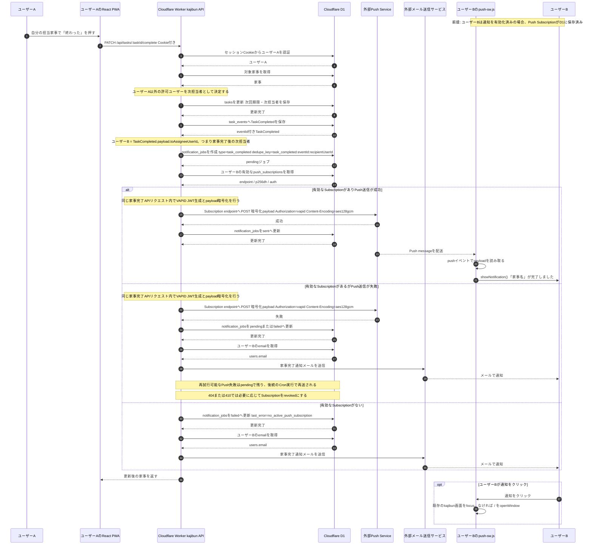

# 家事完了時のリアルタイムPush通知 シーケンス図（メールフォールバック追加）

## 補足

- 家事完了通知は、通知ジョブを保存するだけではなく、家事完了APIの処理内で外部Push Serviceへの送信まで即時試行します。
- Push送信に失敗した場合、または次担当者に有効なPush Subscriptionがない場合は、ユーザーBのメールアドレス宛てに家事完了通知メールを送ります。
- 次担当者に有効なPush Subscriptionがない場合でも通知ジョブは作成され、`failed`として記録されます。
- 外部Push Service内部の配送経路や再送処理は、このリポジトリから確認できないため詳細化していません。
- メール送信サービスの具体的な事業者名は固定せず、外部メール送信サービスとして表現しています。
