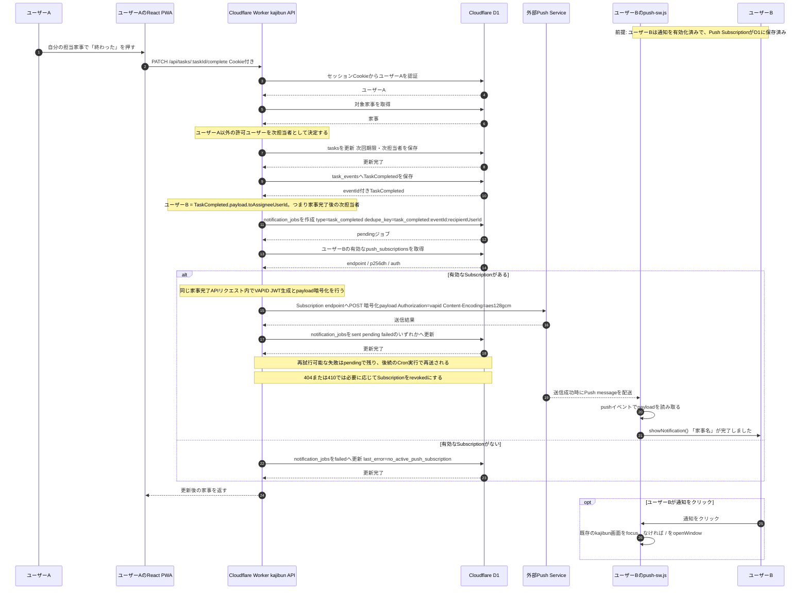

# 家事完了時のリアルタイムPush通知 シーケンス図

## 補足

- 家事完了通知は、通知ジョブを保存するだけではなく、家事完了APIの処理内で外部Push Serviceへの送信まで即時試行します。
- 次担当者に有効なPush Subscriptionがない場合でも通知ジョブは作成され、`failed`として記録されます。
- 外部Push Service内部の配送経路や再送処理は、このリポジトリから確認できないため詳細化していません。
